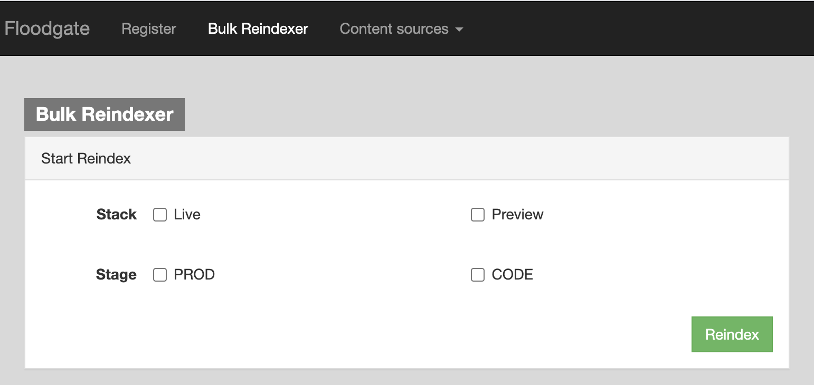
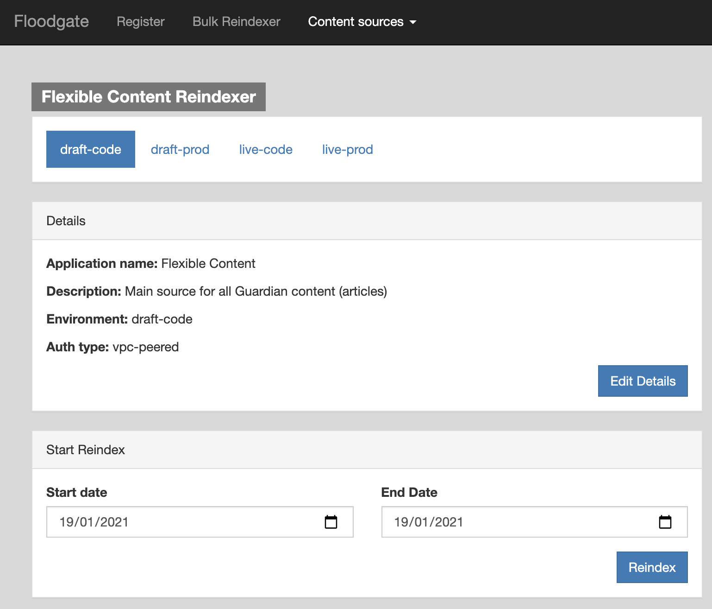

# floodgate

## Overview
Floodgate is an application designed to control the initiation, and monitoring of progress for the reindexing of content from the various content sources the Content API relies upon within the Guardian.

Floodgate is designed to be self service so that when a new content editor, and consequently, a new content source is created, the client can register themselves to Floodgate for reindexing by providing us with specific details that abide to a contract. 
 
## To run locally

```
$ ./scripts/setup.sh
$ ./scripts/start.sh
```

Note: After the first time of running, if no dependencies have been added to package.json you may simply do:

```
$ ./scripts/start.sh
```

## To run the tests

To run the tests you will need to do the following:
```
$ sbt test
```

## Integrating with Floodgate

If you are implementing a new content source and you want to reindex your content using Floodgate, please refer to [this doc](docs/implementing-a-content-source.md)


## Requesting a reindex

Floodgate can be used to request a bulk reindex of an entire stack or a partial reindex from a specific content source.

### Bulk reindex

Will request reindexing of all content from all registered content sources for given stack.

Click Bulk Reindexer and select a Stack / Stage pair.



### Partial reindex

Select a content source from the Content Sources dropdown.
Select the stack.
Set the date range to filter the range of content to be reindexed.



